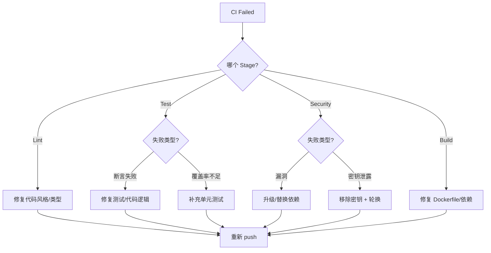

# CI Pipeline 定义 — 数学冒险世界 阶段 3

> 日期：2026-06-01 | 角色：DevOps
> 说明：CI 阶段定义和关键命令（非完整 YAML），配合 GitHub Actions 使用。
> Git 策略：Trunk-Based Development（单人项目，直接提交 main，PR 为可选质量门禁）

---

## 1. Pipeline 概览

```
Trigger: push (main) / pull_request (任意分支)
        ┌─────────────────────────────────────────────┐
        │      Stage 1: Lint (≈ 2 min)                │
        │  ruff check → ruff format --check → mypy    │
        └──────────────┬──────────────────────────────┘
                       ▼
        ┌─────────────────────────────────────────────┐
        │      Stage 2: Test (≈ 5 min)                │
        │  pytest --cov=src --cov-fail-under=80       │
        │  核心决策引擎 → --cov-fail-under=90          │
        └──────────────┬──────────────────────────────┘
                       ▼
        ┌─────────────────────────────────────────────┐
        │      Stage 3: Security (≈ 3 min)            │
        │  pip-audit + detect-secrets                 │
        └──────────────┬──────────────────────────────┘
                       ▼
        ┌─────────────────────────────────────────────┐
        │      Stage 4: Build (≈ 2 min)               │
        │  docker compose build                       │
        └──────────────┬──────────────────────────────┘
                       ▼
                  ✅ Pipeline Passed
```

### 并行 vs 串行策略

| 决策 | 原因 |
|------|------|
| Stage 1 → 2 → 3 → 4 **串行** | 失败快速反馈，后一阶段依赖前一阶段产物（如测试依赖编译后的包） |
| Stage 3 Security 后可接 Azure/OSS 镜像扫描 | 需要外部服务 |
| 非 main 分支可跳过 Stage 4 | 仅 main 需要构建镜像 |

---

## 2. Stage 1: Lint

### 目的
代码风格一致性 + 类型安全保证。

### 关键命令

```bash
# 2a. ruff check（lint + 自动修复检查）
uv run ruff check src/
# 退出码非零 = 有 lint 错误

# 2b. ruff format（格式合规检查，不修改文件）
uv run ruff format --check src/
# 退出码非零 = 格式不合规

# 2c. mypy strict 类型检查
uv run mypy --strict src/
# 退出码非零 = 类型错误
```

### 门禁红线
- **零容忍**：`ruff check` 不允许任何 `E`/`F`/`I`/`B` 类错误
- **零容忍**：`mypy --strict` 不允许任何类型错误
- **允许例外**：`# type: ignore[xxx]` 必须附注释说明原因，总数 ≤ 5 处/PR

---

## 3. Stage 2: Test

### 目的
确保功能正确性 + 覆盖率达标。

### 关键命令

```bash
# 完整测试 + 覆盖率报告
uv run pytest \
  --cov=src \
  --cov-report=term \
  --cov-report=xml:coverage.xml \
  --cov-fail-under=80 \
  tests/

# 核心决策引擎独立覆盖率检查
uv run pytest \
  --cov=src/services/decision_engine \
  --cov-report=term \
  --cov-fail-under=90 \
  tests/services/decision_engine/
```

### 测试策略

| 测试层级 | 工具 | 目标 | 触发条件 |
|----------|------|------|---------|
| 单元测试 | pytest + pytest-asyncio | 每层 ≥ 80% | 每次 push |
| 集成测试 | pytest + httpx AsyncClient | 关键路径覆盖 | 每次 PR |
| E2E 测试 | pytest + httpx | 完整冒险流程 | 每日/预发布 |
| 性能测试 | locust/k6 | P95 < 60s | 里程碑 M3/M4 |

### 门禁红线
- 整体覆盖率 ≥ 80%
- 核心决策引擎覆盖率 ≥ 90%
- 新代码行覆盖率 ≥ 95%（`--cov-branch` 辅助检查）

---

## 4. Stage 3: Security

### 目的
Python 依赖漏洞扫描 + 密钥泄露检测。

### 关键命令

```bash
# 3a. pip-audit 依赖漏洞扫描
uv run pip-audit \
  --strict \
  --require-hashes \
  --skip-editable \
  -r pyproject.toml

# 3b. detect-secrets 密钥泄露检测
uv run detect-secrets scan \
  --baseline .secrets.baseline \
  src/ config/ docker/

# 3c. （可选）Bandit 静态安全分析
uv run bandit -r src/ -ll
```

### 门禁红线
- `pip-audit` 零已知漏洞
- `detect-secrets` 零新发现（baseline 已追踪的除外）
- 新增依赖必须经过许可证合规检查

---

## 5. Stage 4: Build

### 目的
验证 Docker 镜像可正常构建。

### 关键命令

```bash
# 构建所有服务容器
docker compose build

# （可选）构建并启动后运行冒烟测试
docker compose up -d
# 等待 10s 后检查健康端点
curl -f http://localhost:8000/health
# 若健康检查通过 → 构建成功
docker compose down
```

### 门禁红线
- `docker compose build` 退出码必须为 0
- 构建后的镜像必须通过健康检查

---

## 6.  Red Team Security（可选 Stage 5，里程碑专用）

参照 `docs/安全架构设计-数学冒险世界-v1.md` §7 自动红队测试：

```bash
uv run python scripts/red_team_runner.py \
  --seed-lib tests/security/seeds/ \
  --report-dir reports/security/
```

- 突破率 < 1%
- 种子库 ≥ 54 条（14 条核心 + 40 条变异）
- 每季度种子库动态维护

---

## 7. CI 配置建议（GitHub Actions）

### GitHub Actions 矩阵策略（单人项目简化版）

```yaml
# .github/workflows/ci.yml （骨架）
name: CI
on: [push, pull_request]

jobs:
  lint:
    runs-on: ubuntu-latest
    steps:
      - uses: actions/checkout@v4
      - uses: astral-sh/setup-uv@v3
      - run: uv sync --group dev
      - run: uv run ruff check src/
      - run: uv run ruff format --check src/
      - run: uv run mypy --strict src/

  test:
    needs: lint
    runs-on: ubuntu-latest
    services:
      postgres:  ...  # 16
      redis:     ...  # 7
      milvus:    ...  # 2.4
    steps:
      - uses: actions/checkout@v4
      - uses: astral-sh/setup-uv@v3
      - run: uv sync --group dev
      - run: uv run pytest --cov=src --cov-fail-under=80 tests/

  security:
    needs: test
    runs-on: ubuntu-latest
    steps:
      - uses: actions/checkout@v4
      - uses: astral-sh/setup-uv@v3
      - run: uv sync --group dev
      - run: uv run pip-audit --strict -r pyproject.toml

  build:
    needs: security
    if: github.ref == 'refs/heads/main'
    runs-on: ubuntu-latest
    steps:
      - uses: actions/checkout@v4
      - run: docker compose build
```

### 为什么不用 CI 矩阵

| 因素 | 单人项目适用 | 说明 |
|------|:----------:|------|
| 并行节约时间 | 有限 | 串行已经够快（≈12 min 完成全部） |
| 资源占用 | 更低 | 串行避免同时启动 3 个数据库服务 |
| 配置复杂度 | 更低 | 不需要 matrix 策略和产物传递 |
| 故障定位 | 更清晰 | 哪个 Stage 失败一目了然 |

---

## 8. CI 失败响应流程



---

## 附录：环境变量要求（CI 中注入）

| 变量 | 用途 | 必填 |
|------|------|:----:|
| `DEEPSEEK_API_KEY` | LLM API 调用 | CI 测试阶段否（mock） |
| `DATABASE_URL` | PostgreSQL 连接 | 是 |
| `REDIS_URL` | Redis 连接 | 是 |
| `MILVUS_HOST` | Milvus 连接 | 是 |
| `SECRET_KEY` | JWT 签名密钥 | 是 |
| `PYTHONPATH` | `src/` 加入模块搜索路径 | 是 |
