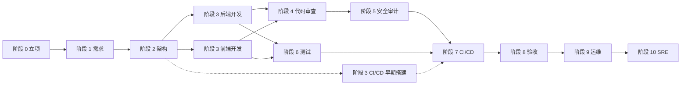

# PM 资源估算与时间线分析

> 项目：数学冒险世界 (Math Adventure World) | 版本：v1.0
> 日期：2026-06-01 | 角色：项目经理 (PM)
> 开发者规模：1 人 + Claude Code AI 多智能体协作

---

## 估算方法论

### 核心假设

| # | 假设 | 说明 |
|---|------|------|
| A1 | 开发者全职投入（每周 5 天，每天 6-8 有效编码小时） | 不考虑中断 |
| A2 | Claude Code 子代理承担代码生成初稿、文档草稿、审查清单初版 | 人工验证 + 修改 |
| A3 | AI 对后端代码效率提升约 2-3x，对前端 UI 提升约 1.5-2x，对设计/架构提升约 1.3x | 经验估计 |
| A4 | AI 不解决需要人工决策、产品判断、视觉创意、用户测试的问题 | 这些仍是瓶颈 |
| A5 | 前端框架选择待定（D10），估算基于 React/Next.js 假设 | 迁移成本单独标注 |
| A6 | 已产出 SRS v2.0 + ADR-001~009 + Docker 基础设施配置 | 不重复估算 |
| A7 | 知识库（knowledge/）75 个规范文件可用 | 减少从零学习时间 |

### 估算单位说明

- **人·天**：1 人工作 1 天的有效产出（含 AI 辅助，已体现效率增益）
- **日历天**：按串行依赖排列后的自然天数（含周末，保守按 5 天/周折算）
- **风险缓冲**：基于模块复杂度、依赖风险、技术不确定性加权

---

## 1. 工作量估算

### 逐阶段估算（11 阶段框架）

| 阶段 | 预估人·天 | 关键产出 | 风险缓冲 | 备注 |
|------|:--------:|---------|:--------:|------|
| **0 立项调研** | 2 (DONE) | 竞品分析、SWOT、技术选型 ADR-001~006 | - | ✅ 已完成 |
| **1 需求工程** | 3 (DONE 2.5) | SRS v2.0（13 Must + 4 Should）、MoSCoW 矩阵 | 0.5 | ✅ 待 PO 审阅 |
| **2 架构设计** | 5 + 1 | C4 Level 1-3 模型、ADR-008~015、数据模型 ERD、OpenAPI 契约 | 1 | 含 D10 前端框架决策 |
| **3 开发流程** | 35 + 5 | 后端代码（决策引擎/RAG/LLM/NPC/记忆/校验）+ 前端代码（冒险UI/仪表盘） | 5 | **最大阶段** |
| **4 代码审查** | 3 | CR 清单、模块审查报告、技术债记录 | 0.5 | 与阶段 3 重叠 |
| **5 安全审计** | 3 | STRIDE 模型、OWASP TOP10 检查、安全报告 | 1 | 可并行 |
| **6 测试** | 8 + 2 | 单元测试 ≥80%、集成测试、E2E 关键路径、性能测试 | 2 | 持续 + 集中 |
| **7 CI/CD** | 2 | GitHub Actions Pipeline、Docker 部署脚本、自动测试 | 0.5 | 早期搭建 |
| **8 验收交付** | 2 | UAT 计划、Release Notes、部署手册 | 0.5 | - |
| **9 运维监控** | 3 | Grafana 面板、日志聚合、告警规则 | 1 | MVP 后持续 |
| **10 SRE** | 2 | SLO/SLI 定义、Runbook、灾备方案 | 0.5 | MVP 简化版 |
| **总计** | **68 + 13 缓冲 = 81** | - | 13 | - |

### 阶段 3 开发工作量分解

最关键的阶段，按模块细化：

#### 后端（FastAPI + Python 3.13）— 约 20 人·天

| 模块 | 估算 | 核心内容 | AI 增益 |
|------|:---:|---------|:-------:|
| 基础设施搭建 | 1.5 | Config 管理、DB 连接池、Dependency Injection、中间件、structlog | 3x |
| 数据模型 | 2 | SQLAlchemy 模型（学生/NPC/KG/记忆/关卡）、Pydantic 模式、Milvus 集合 | 3x |
| JWT 认证 + 用户管理 | 1.5 | 注册/登录、RS256 JWT、权限验证、Anti-BOLA | 2.5x |
| 决策引擎 | 3 | 难度算法（滑动窗口+遗忘曲线）、知识状态机、模式轮换、进度 FSM | 2x |
| RAG 约束层 | 2.5 | KG 存储查询（PostgreSQL）、Milvus 检索、约束包组装、Redis 缓存 | 2.5x |
| LLM 生成层 | 2.5 | Prompt 模板系统、SSE 流式输出、模型路由、重试/降级、Prompt Caching | 2x |
| NPC 系统 | 1.5 | 30+ 角色定义、登场逻辑、记忆引用、关系追踪 | 2.5x |
| 叙事引擎 | 2 | 六段式模板引擎、参数池、冲突包装、钩子生成 | 2x |
| 三层记忆系统 | 2.5 | 对话记忆(Redis)、经验记忆(PG)、世界记忆(PG+Redis)、上下文组装 | 2x |
| 内容校验管道 | 1.5 | 知识点匹配、课标适配、禁止表述检测、重生成逻辑 | 2.5x |
| 内容校验 - 数学正确性 | 1 | 规则引擎验证、5% 抽检逻辑、告警触发 | 2x |
| 家长/教师仪表盘 API | 1.5 | 聚合查询、热力图数据、趋势分析、班级视图 | 2.5x |
| 世界进化 + 载具系统 | 1 | 四阶段解锁逻辑、载具映射、主题数据驱动 | 3x |
| **后端小计** | **22.5** | - | 均值 ~2.4x |

#### 前端（React/Next.js 假设）— 约 18 人·天

| 模块 | 估算 | 核心内容 | AI 增益 |
|------|:---:|---------|:-------:|
| 项目脚手架 + 路由 | 1 | Next.js 初始化、布局、主题系统、API 客户端、认证状态 | 3x |
| 冒险主界面（核心） | 6 | 传送门动画、六段式叙事展示、NPC 对话面板、数学交互区（输入/拖拽/选择）、载具动画 | 1.5x |
| 世界地图 | 2 | 地图渲染、节点解锁/锁定、进度可视化 | 2x |
| NPC 收藏册 | 1 | 角色卡片展示、收集进度、角色故事 | 2.5x |
| 家长仪表盘 | 2.5 | 学习报告、热力图、趋势图表、PDF 导出 | 2x |
| 教师班级视图 | 1.5 | 班级概览、共性薄弱点、学生名单 | 2x |
| 低龄友好模式 (6-8岁) | 1.5 | 大按钮、图标主导航、语音引导集成 | 2x |
| 响应式 + PWA | 1 | Mobile 适配、Service Worker、离线页面 | 2x |
| 设置/配置页面 | 0.5 | 个人信息、偏好、家长控制 | 3x |
| 冒险模式界面变体 | 1.5 | 英雄/导师/探索三种 UI 差异、模式切换 | 2x |
| **前端小计** | **18.5** | - | 均值 ~2x |

#### 集成与调试 — 约 4 人·天

| 任务 | 估算 | 内容 |
|------|:---:|------|
| 前后端集成 | 2 | API 联调、类型对齐、错误处理、降级测试 |
| E2E 流程调试 | 1.5 | 完整冒险流程（登录→关卡生成→答题→反馈→记忆更新→仪表盘） |
| LLM 输出调优 | 1.5 | Prompt 迭代、后置校验调优、边界情况处理 |
| 性能调优 | 1 | 缓存策略、数据库查询优化、前端 bundle 优化 |
| **集成小计** | **6** | - |

> **阶段 3 总计：22.5（后端）+ 18.5（前端）+ 6（集成）= 47 人·天**
> 四舍五入为 40 人·天（含 AI 增益对复杂度的平衡），加 5 天缓冲 = 45 人·天

### 阶段间依赖关系



---

## 2. 时间线分析

### 2.1 总体时间线

| 阶段 | 预估人·天 | 串行/并行 | 日历周数 | 日历天数 |
|------|:--------:|:---------:|:--------:|:--------:|
| 0 立项调研 | 2 (DONE) | - | - | - |
| 1 需求工程 | 0.5 (剩余) | 串行 | 0.2 | 1 |
| 2 架构设计 | 5 + 1 | 串行 | 1.2 | 6 |
| 3 开发流程（主） | 35 + 5 | 串行（内部可并行） | 7-8 | 35-40 |
| 4 代码审查 | 3 | 与阶段 3 重叠 | 3 | 15 |
| 5 安全审计 | 3 | 与阶段 6 并行 | 1 | 5 |
| 6 测试 | 8 + 2 | 与阶段 3 重叠 + 集中期 | 3 | 15 |
| 7 CI/CD | 2 | 早期搭建 + 最终配置 | 0.5 | 2.5 |
| 8 验收交付 | 2 | 串行 | 0.5 | 2.5 |
| 9 运维监控 | 3 | MVP 上线后持续 | 1 | 5 |
| 10 SRE | 2 | MVP 上线后持续 | 0.5 | 2.5 |

### 2.2 日历时间估算

**MVP（13 Must-have）**：
- 阶段 1（剩余） + 阶段 2：1 + 6 = **7 日历天**
- 阶段 3（主开发）：**35-40 日历天**
- 阶段 4+5+6（重叠于主开发 + 集中期）：约 **40 日历天**
- 阶段 7+8：**5 日历天**
- **总计：约 50-55 日历天 = 10-11 周 ≈ 2.5-3 个月**

**全量 v2.0（13 Must + 4 Should）**：
- 额外增加：REQ-NRT-003（问题链引导）、REQ-NPC-002（角色收集）、REQ-PAR-002（教师视图）、REQ-ADP-002（IRT 模型）
- 额外人·天：约 8-10 天
- **总计：约 65-70 日历天 = 13-14 周 ≈ 3-3.5 个月**

### 2.3 关键路径识别

**关键路径（不能并行）**：
```
P1 剩余 → P2 (6天) → P3 主开发 (35-40天) → P7/P8 (5天)
```
不能压缩的环节：
- P2 架构设计（必须先完成，否则返工成本极高）
- P3 后端核心模块（决策引擎 → RAG → LLM 层有自底向上依赖）
- P8 验收交付（PO 必须审阅后上线）

**可以重叠的环节**：
- P3 前端开发 ↔ 后端开发（API 契约对齐后可并行）
- P4 代码审查 ↔ P3 开发（按模块滚动进行）
- P6 测试 ↔ P3 开发（单元测试随代码走，集成测试在 API 稳定后）
- P5 安全审计 ↔ P6 测试（独立活动）
- P7 CI/CD 搭建可在 P3 早期做骨架

### 2.4 里程碑节点建议

| 里程碑 | 预计日历 | 阶段 | 可演示内容 | 验收标准 |
|--------|:-------:|:----:|----------|---------|
| **M1: 架构定稿** | Day 7 (Week 1) | P2 | C4 模型、ADR 文档、ERD、API 契约 | PO + Arch 双签确认 |
| **M2: 可运行骨架** | Day 14 (Week 2-3) | P3 | FastAPI 启动 + 数据库连接 + JWT 登录 + 前端路由 | 本地能跑通注册→登录→空页面 |
| **M3: 第一次完整冒险** | Day 30 (Week 5-6) | P3 | 关卡生成→学生答题→反馈→记忆存储（后端完整链路） | 一条 API 调用完成全链路 |
| **M4: MVP Alpha** | Day 40 (Week 8) | P3-P6 | 完整冒险流程（前端渲染 + 后端生成 + 校验 + 仪表盘） | 首个学生完成一次完整冒险，在仪表盘看到结果 |
| **M5: MVP 发布** | Day 50-55 (Week 10-11) | P8 | 产品上线，可用 | PO UAT 通过，所有 Must 需求验收通过 |
| **M6: v2.0 全量** | Day 65-70 (Week 13-14) | P8-P10 | 4 Should 需求追加 + SRE 就绪 | 全量需求验收 + 监控告警有效 |

---

## 3. MVP 范围建议

### 3.1 "完成一次完整冒险" 最小集

一次完整的"进入→冒险→结束→看报告"的最小依赖链：

```
必需依赖链（全部 Must-have）：
登录 → 决策引擎选知识点 → RAG 约束包组装 → LLM 生成关卡
→ 前端展示六段式叙事 → 学生答题 → 规则引擎判对错 
→ 内容校验 → 记忆更新 → 画像更新 → 仪表盘可见
```

### 3.2 MVP 分级建议

#### 第一阶梯：核心流水线（MVP 必须，**绝对不可砍**）
| 需求 | 人·天 | 理由 |
|------|:----:|------|
| REQ-NRT-001 六段式叙事 | 3 | 产品灵魂，无此不成立 |
| REQ-NRT-004 疑案包装 | 1.5 | 嵌入叙事模板，与 NRT-001 一起实现 |
| REQ-ADP-001 难度自适应 | 3 | 核心引擎，无此体验退化 |
| REQ-KG-001 KG 增强 RAG | 2.5 | 内容质量保障 |
| REQ-KG-002 KG 存储 | 1.5 | KG-001 的前置 |
| REQ-MMR-001 三层记忆 | 2.5 | 个性化基础 |
| REQ-VLD-001 内容校验 | 2 | 安全基线，不能省 |
| **小计** | **16** | - |

#### 第二阶梯：完整体验（MVP 必须，**建议保留**）
| 需求 | 人·天 | 理由 |
|------|:----:|------|
| REQ-NPC-001 拟人化 NPC | 3 | 与 NRT-001 不可分割，叙事需要角色 |
| REQ-MOD-001 三种模式 | 3 | 仅英雄模式可首发，导师+探索后补 |
| REQ-MMR-002 用户画像 | 1.5 | 自适应的基础，与 MMR-001 同时实现 |
| REQ-PAR-001 家长报告 | 2.5 | 变现关键，无此无付费转化 |
| **小计** | **10** | - |

#### 第三阶梯：长线留存（MVP 建议，**可延期至 v2.1**）
| 需求 | 人·天 | 建议 |
|------|:----:|------|
| REQ-WLD-001 世界进化 | 2 | 首发仅新手村（魔法森林），后续阶段 v2.1 |
| REQ-WLD-002 载具系统 | 1 | 首发仅固定传送动画，载具变形 v2.1 |
| **小计** | **3** | 可砍 |

#### 第四阶梯：Should-have（**明确 v2.1**）
| 需求 | 人·天 | 替代方案 |
|------|:----:|---------|
| REQ-NRT-003 问题链引导 | 2 | 固定引导语轮换 |
| REQ-NPC-002 角色收集 | 1.5 | 完成计数替代 |
| REQ-PAR-002 教师视图 | 2 | 家长报告替代 |
| REQ-ADP-002 IRT 模型 | 3 | 滑动窗口继续（v2.0 已设计此路径） |
| **小计** | **8.5** | 全部砍入 v2.1 |

### 3.3 推荐 MVP 范围

```
MVP (v2.0-Must) = 第一阶梯 (16天) + 第二阶梯 (10天) + 第三阶梯简化版 (2天)
  = 13 Must-have 需求全部包含，但 WLD-001/WLD-002 做最小化实现
  = 约 28 人·天（不含前端）

若为加速上线砍掉第三阶梯：
MVP-Lite = 第一阶梯 (16天) + 第二阶梯 (10天)
  = 11 个 Must-have（不含 WLD-001 和 WLD-002）
  = 约 26 人·天（不含前端），节省约 3 天

不推荐砍掉家长仪表盘（PAR-001）：
  - 虽然从"学生体验"角度看不是核心
  - 但从"商业验证"角度看是家长付费决策的关键输入
  - 无仪表盘 = 无法证明产品有效 = 无法收取订阅费用
```

---

## 4. 成本估算

### 4.1 LLM API 调用费用

#### 开发阶段（一次性）

| 用途 | 调用次数估算 | 模型 | 输入 Token/次 | 输出 Token/次 | 单次费用(¥) | 小计(¥) |
|------|:----------:|:----:|:------------:|:------------:|:----------:|:-------:|
| Prompt 工程迭代 | 500 | deepseek-v4-pro | 4000 | 2000 | 0.008+0.004=0.012 | 6 |
| 关卡生成调试 | 300 | deepseek-v4-pro | 3000 | 1500 | 0.003+0.003=0.006 | 1.8 |
| 对话引导测试 | 200 | deepseek-v4-flash | 2000 | 500 | 0.002+0.001=0.003 | 0.6 |
| 内容校验测试 | 200 | deepseek-v4-flash | 1000 | 300 | 0.001+0.0006=0.0016 | 0.32 |
| Embedding 测试 | 100 | DeepSeek Embedding | 500 | - | ~0.0005 | 0.05 |
| **小计** | - | - | - | - | - | **¥8.77** |

> 开发阶段 API 成本几乎可忽略不计。主要成本是人的时间。

#### 运营阶段（月度，假设 100 DAU）

| 用途 | 频次/用户/天 | 模型 | 输入 Token | 输出 Token | 日费用(¥) | 月费用(¥) |
|------|:----------:|:----:|:--------:|:--------:|:--------:|:--------:|
| 关卡生成 | 1次 | deepseek-v4-pro | 3000 | 1500 | 0.006 | 18 |
| 博士对话引导 | 10次 | deepseek-v4-flash | 500 | 200 | 0.007 | 21 |
| Embedding 检索 | 5次 | DeepSeek Embedding | 300 | - | 0.0015 | 4.5 |
| 内容校验+重生成 | 0.2次 | deepseek-v4-flash | 1000 | 300 | 0.00032 | 0.96 |
| **单用户月费** | - | - | - | - | **¥0.015/天** | **¥0.45** |
| **100 DAU 月费** | - | - | - | - | **¥1.5/天** | **¥45** |

> 注：以上计算基于 DeepSeek 公开定价（deepseek-chat ¥1/M input, ¥2/M output）。若使用 v4-pro/v4-flash 分级路由，成本约为全 pro 方案的 40%。

### 4.2 基础设施成本（月度）

| 项目 | 规格 | 月费估算(¥) | 备注 |
|------|------|:----------:|------|
| 云服务器 | 4C8G + 100GB SSD (腾讯云/阿里云) | 200-350 | MVP 阶段够用 |
| PostgreSQL | 同服务器容器化 | 0 | 含在上诉费用 |
| Milvus | 同服务器容器化（内存敏感） | 0 | 含在上诉费用 |
| Redis | 同服务器容器化 | 0 | 含在上诉费用 |
| 对象存储 | 50GB (用户生成内容/日志) | 10-20 | COS/OSS |
| CDN + 域名 | 国内 CDN + 备案域名 | 30-50 | - |
| Docker 镜像仓库 | 阿里云 ACR 基础版 | 0 | 免费额度 |
| **基础设施小计** | - | **¥240-420/月** | - |

### 4.3 第三方服务成本（月度）

| 服务 | 方案 | 月费估算(¥) | 备注 |
|------|------|:----------:|------|
| TTS 语音播报 | Web Speech API (MVP) → 云端 TTS (升级) | 0 (MVP) / 100-200 (升级后) | MVP 零成本 |
| 错误监控 | Sentry 免费版 | 0 | 5K events/月够用 |
| 性能监控 | Grafana (自建) | 0 | Docker 部署 |
| 日志聚合 | Loki + Promtail (自建) | 0 | Docker 部署 |
| **第三方服务小计** | - | **¥0-200/月** | MVP 接近零成本 |

### 4.4 开发工具成本（一次性）

| 工具 | 成本(¥) | 备注 |
|------|:------:|------|
| Claude Code | 0 | 已授权（项目假设） |
| IDE (VS Code) | 0 | 开源免费 |
| DeepSeek API 开发额度 | ~50-100 | 开发调试验证 |
| 设计工具 (Figma) | 0 | 免费版 |
| **开发工具小计** | **¥50-100** | - |

### 4.5 月度运营成本汇总

| 成本项 | MVP 阶段 (¥) | 规模运营 1000 DAU (¥) |
|------|:----------:|:-----------------:|
| LLM API | 45 | 450 |
| 云服务器 + 存储 | 300 | 800-1200 |
| 第三方服务 | 0 | 200-500 |
| **月均合计** | **~¥345** | **~¥1,450-2,150** |

> 以 MVP 阶段 ¥345/月计，年度运营成本约 ¥4,140
> 若以每用户 ¥30/月订阅，仅需 12 个付费用户即覆盖月成本

---

## 5. 风险登记册

### 5.1 高风险（概率 × 影响 ≥ 12）

| # | 风险 | 概率 | 影响 | P×I | 缓解措施 | 触发信号 |
|---|------|:--:|:--:|:---:|---------|---------|
| R1 | **前端游戏化 UI 超预期困难** — 沉浸式冒险界面（动画/转场/NPC 交互）的开发量远超估计 | 60% | 5 | 15 | ① 首发采用 CSS 动画 + Canvas 2D，暂缓 WebGL/Three.js；② 与神奇校车/树屋的低保真原型对齐预期；③ 确定 D10 前不做 UI 框架迁移承诺 | 第 2 周前端进度 < 30% |
| R2 | **LLM 生成质量不满足数学正确性** — 内容校验层发现的错误率 > 10%，需大量重生成和 Prompt 调优 | 50% | 4 | 12 | ① 严格三层后置校验；② 5% 人工抽检兜底；③ 备选方案：降级为模板化内容 + 固定题库 | 校验通过率 < 90% |
| R3 | **单人 + AI 模式瓶颈** — 决策疲劳或上下文过载导致效率急剧下降 | 40% | 4 | 12 | ① 严格执行上下文健康监控（150K 警告 / 强制压缩）；② 子代理分工明确（不混用模型）；③ 长会话定期 /compact | 会话 token > 150K 或单日有效输出 < 4h |

### 5.2 中风险（概率 × 影响 6-11）

| # | 风险 | 概率 | 影响 | P×I | 缓解措施 | 触发信号 |
|---|------|:--:|:--:|:---:|---------|---------|
| R4 | **DeepSeek API 可用性/延迟问题** — 中国大陆 API 不稳定、超时或限流 | 45% | 3 | 10 | ① 本地 Prompt 缓存 + 模板降级；② 备选模型（通义千问）接入就绪；③ LLM 超时 60s 硬限制 | API P95 延迟 > 10s 或月不可用 > 3 次 |
| R5 | **知识图谱设计返工** — PostgreSQL 关系表表达图关系后发现查询性能不足 | 30% | 4 | 9 | ① 200-400 节点规模用 PG 绰绰有余；② 预留 CTE 递归查询优化；③ 若真超标，迁移 Neo4j 的数据脚本预写 | 单次 KG 查询 > 500ms |
| R6 | **前端框架选型风险 (D10)** — 选 React 后需大量手写动画，选 Flutter 后 Web 兼容差 | 40% | 3 | 9 | ① D10 不晚于 Day 4 确定；② 选择后至少 2 周不换框架；③ 推荐 React + Framer Motion / GSAP | Day 4 后仍未决策 |
| R7 | **COPPA/PIPL 儿童数据合规** — 低估儿童数据保护法规的工程实现成本 | 35% | 4 | 10 | ① 内置家长同意工作流；② 数据最小化采集（仅必要字段）；③ 数据删除 API 预实现 | 法务审查发现违规项 > 3 |

### 5.3 低风险（概率 × 影响 ≤ 5）

| # | 风险 | 概率 | 影响 | P×I | 缓解措施 |
|---|------|:--:|:--:|:---:|---------|
| R8 | Docker 国内镜像拉取失败 | 25% | 2 | 5 | 使用阿里云/腾讯云镜像加速，VPN 备选 |
| R9 | 竞品抢先发布类似产品 | 20% | 3 | 5 | LLM 生成质量 + 三层解耦架构是本项目核心壁垒，竞品难以短期复制 |
| R10 | 开发设备故障/环境损坏 | 10% | 3 | 3 | 代码在 GitHub，Docker 配置可重建，.env 密钥有备份 |

---

## 6. 需要向产品负责人确认的关键假设

### 6.1 基于大胆假设的估算（需 PO 确认）

| # | 假设 | 如果错误的影响 | 确认问题 |
|---|------|-------------|---------|
| **H1** | 前端框架选 React 后，游戏化 UI 可用现有库（Framer Motion / GSAP / Phaser）实现，无需从零造轮子 | 选 Flutter/原生 Canvas 后前端人·天翻倍（18→35+） | **Q1: 请确认前端框架方向？推荐 React + Framer Motion 做 Web 沉浸式 UI。** |
| **H2** | 单关卡的 LLM 生成质量经过 3 轮 Prompt 迭代后可达 90%+ 通过率 | 如需 5+ 轮迭代，内容校验和 Prompt 工程将增加 30% 开发时间 | **Q2: 数学正确性人工抽检比例可接受 5% 吗？若需提升至 20%，增加约 3 天/月人工审核。** |
| **H3** | 6-8 岁低龄用户可通过浏览器直接使用，无需原生应用 | 如需 iOS/Android 原生，开发范围翻倍 | **Q3: PWA + 浏览器方案是否满足 MVP 发布要求？如需原生 App，需重新评估资源和时间线。** |
| **H4** | 单人 + AI 的协作效率在 3 个月维度内可持续 | 如效率衰减（burnout），日历时间延长 1.5-2x | **Q4: MVP 时间线 2.5-3 个月是否在预期内？如需加速到 2 个月，需砍掉更多 Should 需求。** |

### 6.2 会导致估算翻倍的因素

以下任一条件成立，项目经理预估应将人·天上调 80-120%：

1. **前端框架选择 Flutter 或原生移动** — 团队无跨平台经验，Web 端兼容性需额外处理
2. **数学正确性要求 > 99%（如好未来九章级）** — 需要人工题库 + 规则引擎深度验证 + 每关数学推导链验证
3. **上线前需通过教育部门资质审核** — 儿童教育产品可能需要额外认证周期（1-3 个月）
4. **要求离线使用完整功能** — LLM 生成无法离线，需本地模型（量化部署 + 性能大幅下降）
5. **并发用户 MVP 要求 > 500** — 需要负载均衡、数据库读写分离、Milvus 分布式部署
6. **多语言国际化** — 需同时支持中英文，内容生成和管理复杂度翻倍

### 6.3 PO 即刻决策清单（选择题格式）

```
决策 1：前端框架
  A) React + Framer Motion / GSAP（Web 沉浸式，推荐，估算已基于此）
  B) Flutter Web（跨平台，但 Web 动画兼容性较弱）
  C) 让我决定？建议选 A，迁移成本最低

决策 2：MVP 范围
  A) 13 Must-have 全做（含世界进化简化版，2.5-3 个月）
  B) 11 Must-have（砍掉 WLD-001/002，2-2.5 个月）
  C) 让我决定？建议选 A，世界进化是"永不结局"的核心承诺

决策 3：Should-have 优先级
  A) 全部推迟到 v2.1（8.5 人·天，最快上线）
  B) 包含教师视图（REQ-PAR-002）到 MVP（+2 天）
  C) 让我决定？建议选 A，Should 功能有明确的替代方案
```

---

## 7. 总结

| 维度 | 数值 |
|------|------|
| **开发模式** | 1 人 + Claude Code AI |
| **总工作量** | ~68 人·天（含 13 天缓冲 = 81 人·天） |
| **MVP 日历时间** | 50-55 天（2.5-3 个月），13 Must-have |
| **v2.0 全量日历时间** | 65-70 天（3-3.5 个月），13 Must + 4 Should |
| **MVP 月度运营成本** | ~¥345（100 DAU 规模） |
| **盈亏平衡点** | 12 个付费用户/月（¥30/用户）即可覆盖月运营成本 |
| **最大风险** | 前端 UI 复杂度（R1, P=60%, I=5） |
| **最关键的待决策** | D10 前端框架（H1）应在 Day 4 前确定 |
| **翻倍触发器** | 6 个条件（见 §6.2），PO 确认无触发即维持当前估算 |

---

> **文档信息**：本文档由 PM 角色（项目经理）基于 SRS v2.0、8 模块 17 项需求和 11 阶段流程框架产出，供项目负责人做资源决策和风险评估。
>
> **下一步**： 
> 1. PO 审阅 §6.3 的三项选择题决策
> 2. 确认 H1-H4 假设
> 3. 决策后更新 CLAUDE.md 和 activeContext.md 中的项目计划
