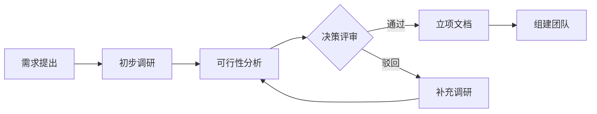

# 立项与调研规范

## 概述

立项与调研是软件工程生命周期的起点，决定项目是否值得投入资源。本规范涵盖可行性分析、技术选型决策、竞品分析、Make vs Buy 决策以及立项文档编写，确保每个项目在启动前都经过充分论证。

---

## 核心规则

### MUST（必须遵守）

1. **MUST - 可行性分析三要素完备**
   - 技术可行性：评估核心技术难度、团队能力、技术栈成熟度
   - 经济可行性：估算开发成本、运维成本、预期收益、ROI
   - 法律可行性：确认许可证合规、数据隐私法规（GDPR/PIPL）、行业监管要求

2. **MUST - 技术选型须记录决策理由**
   - 所有重大技术选型（语言、框架、数据库、消息队列等）必须记录决策上下文、备选方案、选择理由
   - 使用 ADR（Architecture Decision Record）格式

3. **MUST - 竞品分析至少覆盖 3 个竞品**
   - 直接竞品（相同赛道）、间接竞品（解决相同问题的不同方案）、潜在竞品（跨界可能进入的玩家）

4. **MUST - 立项文档须经相关方签字确认**
   - 至少包括产品负责人、技术负责人、财务负责人签署

### SHOULD（应该遵守）

1. **SHOULD - 做原型验证（PoC）**
   - 对高风险的可行性问题，应优先开发最小原型验证
2. **SHOULD - 评估替代方案至少 3 种**
   - 任何重大决策不应只有"做"和"不做"两种选择
3. **SHOULD - 进行 SWOT 分析**
   - 优势（Strengths）、劣势（Weaknesses）、机会（Opportunities）、威胁（Threats）

### MAY（可以遵守）

1. **MAY - 引入外部专家评审**
2. **MAY - 使用决策矩阵进行量化评分**
3. **MAY - 输出 TCO（总拥有成本）模型**

---

## 流程与检查清单

### 立项调研流程



### 可行性分析检查清单

| 维度 | 检查项 | 结果 |
|------|--------|------|
| 技术可行性 | 核心技术是否有成熟方案？ | YES/NO/Unknown |
| 技术可行性 | 团队是否具备必要技能？ | YES/NO/Unknown |
| 技术可行性 | 与现有系统集成复杂度？ | High/Medium/Low |
| 经济可行性 | 预计开发成本（人月）？ | 数字 |
| 经济可行性 | 预计年度运维成本？ | 数字 |
| 经济可行性 | 预期 ROI 回本周期？ | 月数 |
| 法律可行性 | 是否存在许可证冲突？ | YES/NO |
| 法律可行性 | 数据合规是否满足？ | YES/NO/Unknown |

### 技术选型决策框架

1. **业务匹配度**（权重 30%）：是否满足核心业务需求
2. **技术成熟度**（权重 20%）：社区活跃度、版本稳定性、生态丰富度
3. **团队能力**（权重 20%）：学习成本、人才市场供给
4. **运维成本**（权重 15%）：部署复杂度、监控可观测性、故障恢复能力
5. **扩展性**（权重 15%）：水平扩展能力、模块化程度、技术债风险

### Make vs Buy 决策矩阵

| 因素 | 自建 (Make) | 采购 (Buy) |
|------|------------|------------|
| 核心业务竞争力 | 建议自建 | 不建议采购 |
| 定制化需求 | 高 | 低 |
| 时间窗口 | 充裕 | 紧迫 |
| 长期维护成本 | 高 | 低（含 License） |
| 团队能力 | 具备 | 不具备 |
| 市场成熟方案 | 无 | 有 |

**指导原则**：核心竞争力必须自建，非核心竞争力优先采购或使用开源方案。

### 立项文档模板

```markdown
# 项目立项申请书

## 1. 项目基本信息
- 项目名称：
- 项目编号：
- 提出部门：
- 产品负责人：
- 技术负责人：
- 拟稿日期：

## 2. 项目背景与目标
- 业务背景：
- 解决的问题：
- 预期目标（OKR/KPI）：

## 3. 范围
- 包含功能：In Scope
- 不包含功能：Out of Scope
- 约束条件：时间/预算/法规

## 4. 可行性分析摘要
- 技术可行性结论：
- 经济可行性结论（ROI）：
- 法律可行性结论：

## 5. 技术选型方案
- 后端技术栈：
- 前端技术栈：
- 数据库：
- 基础设施：
- 决策 ADR 链接：

## 6. 资源需求
- 开发团队规模：
- 预计工期：
- 预算估算：

## 7. 风险评估
- 技术风险：
- 业务风险：
- 外部依赖风险：

## 8. 签署
- 产品负责人（签名）：
- 技术负责人（签名）：
- 财务负责人（签名）：
- 批准日期：
```

---

## 参考来源

- IEEE 1633-2016 - Recommended Practice on Software Reliability
- ISO/IEC 12207 - Software Life Cycle Processes
- CMMI for Development v2.0
- Wardley Maps - Strategy and Decision Making
- Technology Radar - ThoughtWorks
