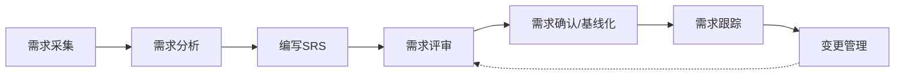

# 需求工程规范

## 概述

需求工程是软件工程的核心环节，决定了"做什么"的问题。本规范基于 IEEE 830 标准，涵盖 SRS 模板、用户故事编写、验收标准定义、需求优先级划分（MoSCoW）及需求变更管理，确保需求从采集到交付全过程可追溯、可验证。

---

## 核心规则

### MUST（必须遵守）

1. **MUST - SRS 须符合 IEEE 830 结构**
   - 软件需求规格说明必须包含：引言、总体描述、外部接口需求、系统功能需求、非功能需求

2. **MUST - 用户故事采用标准三句式**
   - 格式：`As a <角色>, I want <功能>, So that <价值>`
   - 每个用户故事必须是独立的、可协商的、有价值的、可估算的、小的、可测试的（INVEST 原则）

3. **MUST - 验收标准使用 Given/When/Then 格式**
   - Given（给定上下文）→ When（当执行操作）→ Then（期望结果）

4. **MUST - 需求须有唯一标识符**
   - 格式：`REQ-{模块}-{序号}`，如 `REQ-AUTH-001`，确保需求可追溯

5. **MUST - 功能性需求与非功能性需求明确区分**
   - 功能性需求描述系统"做什么"
   - 非功能性需求描述系统"怎么做"（性能、安全、可用性等）

### SHOULD（应该遵守）

1. **SHOULD - 使用 MoSCoW 方法进行优先级划分**
   - Must have（必须有）| Should have（应该有）| Could have（可以有）| Won't have（本次不做）

2. **SHOULD - 建立需求跟踪矩阵**
   - 将每个需求映射到设计、实现和测试用例

3. **SHOULD - 每轮迭代前做需求澄清会**
   - 避免开发中频繁的需求疑问

4. **SHOULD - 非功能性需求须可量化**
   - 如"响应时间 < 200ms at P99，并发 1000 QPS"

### MAY（可以遵守）

1. **MAY - 使用 BDD（行为驱动开发）丰富用户故事**
2. **MAY - 建立需求优先级权衡矩阵**
3. **MAY - 使用领域驱动设计（DDD）中的 Ubiquitous Language**

---

## 流程与检查清单

### 需求工程流程



### SRS 模板（IEEE 830）

```markdown
# 软件需求规格说明 SRS

## 1. 引言
   - 1.1 目的
   - 1.2 文档约定
   - 1.3 目标读者
   - 1.4 项目范围
   - 1.5 参考文献

## 2. 总体描述
   - 2.1 产品视角
   - 2.2 用户特征
   - 2.3 假设与依赖

## 3. 外部接口需求
   - 3.1 用户界面
   - 3.2 硬件接口
   - 3.3 软件接口
   - 3.4 通信接口

## 4. 系统功能需求
   - 4.1 功能模块 A
     - REQ-A-001: ...
     - REQ-A-002: ...
   - 4.2 功能模块 B
     - REQ-B-001: ...

## 5. 非功能需求
   - 5.1 性能需求（响应时间/吞吐量）
   - 5.2 安全需求（认证/授权/加密）
   - 5.3 可用性需求（SLA 99.9%）
   - 5.4 可维护性需求
   - 5.5 可移植性需求
```

### 用户故事与验收标准范例

```markdown
## 用户故事 US-LOGIN-001
As a 已注册用户
I want 使用邮箱和密码登录系统
So that 我可以访问我的个人账户

### 验收标准（Acceptance Criteria）
Scenario 1: 正常登录
  Given 用户已注册且账户状态正常
    And 用户输入正确的邮箱和密码
  When 用户点击"登录"按钮
  Then 系统验证凭证通过
    And 用户跳转到首页
    And 系统生成有效的 Session Token

Scenario 2: 密码错误
  Given 用户已注册
    And 用户输入正确的邮箱但错误的密码
  When 用户点击"登录"按钮
  Then 系统返回"邮箱或密码错误"提示
    And 登录失败次数 +1
```

### MoSCoW 优先级矩阵

| 优先级 | 含义 | 占比建议 | 处理方式 |
|--------|------|----------|----------|
| Must have | 没有此功能系统无法上线 | 40-60% | 本轮必须交付 |
| Should have | 重要但不紧急，有替代方案 | 20-30% | 尽量交付 |
| Could have | 锦上添花的功能 | 10-20% | 有余力再交付 |
| Won't have | 明确本次不做 | 10% | 放入 Backlog |

### 需求变更管理流程

```
变更请求发起 → 变更影响评估（时间/成本/质量） → CCB（变更控制委员会）审批 
→ 更新 SRS → 通知相关方 → 更新开发计划
```

### 需求检查清单

| 检查项 | 标准 |
|--------|------|
| 完整性 | 是否覆盖所有用户场景？ |
| 一致性 | 是否存在需求间冲突？ |
| 可测试性 | 每个需求是否有明确的验收标准？ |
| 可追溯性 | 是否有唯一标识符？ |
| 无歧义性 | 是否只有一种理解方式？ |
| 必要性 | 是否每个需求都有明确业务价值？ |

---

## 参考来源

- IEEE 830-1998 - Recommended Practice for Software Requirements Specifications
- ISO/IEC/IEEE 29148 - Systems and Software Engineering - Requirements Engineering
- Mike Cohn - User Stories Applied
- INVEST原则 - Bill Wake
- MoSCoW Method - Dai Clegg, Oracle
- Gherkin Reference - Cucumber
