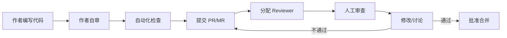

# 代码审查规范

## 概述

代码审查（Code Review）是保证代码质量、知识传递和团队协作的关键实践。本规范涵盖审查的多维检查、标准化流程、评论写作礼仪、审查清单模板和常见反模式，帮助团队建立高效、健康、建设性的审查文化。

---

## 核心规则

### MUST（必须遵守）

1. **MUST - 每次 PR 至少经过 1 人人工审查**
   - 关键模块（支付、安全、数据敏感）必须 2 人以上审查
   - 紧急修复（Hotfix）可放宽但事后须补充审查

2. **MUST - 审查覆盖 5 个核心维度**
   - 正确性（Correctness）：逻辑是否自洽？边界条件是否处理？
   - 安全性（Security）：是否存在注入、越权、数据泄露风险？
   - 性能（Performance）：是否存在不必要的循环、频繁 IO、内存泄漏？
   - 可读性（Readability）：命名是否清晰？复杂度是否可控？
   - 可维护性（Maintainability）：是否便于后续扩展和修改？

3. **MUST - 审查者确认合并前的完整性**
   - 确保已覆盖测试、文档同步更新、无死代码、无密钥泄漏

4. **MUST - 不使用 Lint/Format 类评论**
   - 此类问题应通过自动化工具解决，不浪费人工审查时间

### SHOULD（应该遵守）

1. **SHOULD - 单次 PR 变更量 < 400 行**
   - 超过 400 行时建议拆分为多个 PR
   - 研究表明超过 400 行的审查效率急剧下降

2. **SHOULD - 审查者在 24 小时内响应**
   - 避免 PR 长时间阻塞影响开发效率

3. **SHOULD - 作者在合并前自行 Review 一次**
   - 很多低级错误可在自审阶段发现

4. **SHOULD - 使用 Review Checklist 记录检查结果**
   - 便于跟踪和改进审查质量

### MAY（可以遵守）

1. **MAY - 使用 Review 辅助工具（SonarQube / CodeRabbit）**
2. **MAY - 建立模块 Owner 制度**
3. **MAY - 定期做 Team Review 提升整体代码质量**

---

## 流程与检查清单

### CR 流程



### 审查维度详解

| 维度 | 检查重点 | 常见问题 |
|------|----------|----------|
| 正确性 | 逻辑边界、条件覆盖、异常处理 | off-by-one 错误、未处理 null/undefined |
| 安全性 | 输入校验、权限检查、加密 | SQL 注入、XSS、敏感信息硬编码 |
| 性能 | 算法复杂度、资源管理、缓存 | N+1 查询、内存泄漏、频繁 GC |
| 可读性 | 命名一致性、函数长度、注释质量 | 魔法数字、超长函数、误导性注释 |
| 可维护性 | 模块耦合度、重复代码、设计模式 | 复制粘贴、过度耦合、缺乏抽象 |

### Code Review 评论礼仪

| 场景 | 推荐写法 | 不推荐写法 |
|------|----------|------------|
| Bug 发现 | "这里当 input 为空时会抛 NullPointerException，建议加个空检查" | "这里炸了" |
| 设计建议 | "考虑用 Strategy Pattern 替代目前的 if-else 链，扩展性更好" | "这样写太丑了" |
| 学习型问题 | "这个 for 循环可以用 `reduce` 简化吗？" | "连 reduce 都不会？" |
| 确认型 | "这段逻辑是在处理超时重试吗？确认下我的理解" | "什么意思？" |
| 同意 | "好方案，LGTM" | 无评论直接 Approve |

**黄金法则**：对代码不对人（Review the code, not the author）。使用第一人称复数"我们"而非"你"。

### 审查清单模板

```markdown
## Code Review Checklist

### 正确性
- [ ] 功能逻辑是否正确覆盖所有业务场景？
- [ ] 边界条件（空值、越界、并发）是否处理？
- [ ] 异常路径是否正确处理（try-catch、fallback）？

### 安全性
- [ ] 用户输入是否经过校验和转义？
- [ ] 权限校验是否在服务端完成？
- [ ] 敏感信息（密码、Token、密钥）是否未硬编码？
- [ ] 是否存在 SSRF/XXE 等注入风险？

### 性能
- [ ] 是否存在不必要的数据库查询（N+1）？
- [ ] 循环中是否有非必要的 IO 操作？
- [ ] 缓存策略是否合理？

### 可读性
- [ ] 变量/函数命名是否清晰表达意图？
- [ ] 函数是否不超过 50 行？是否单一职责？
- [ ] 是否有足够的注释解释 Why（而非 What）？

### 可维护性
- [ ] 是否存在重复代码需要抽取？
- [ ] 是否遵循项目已有的设计模式？
- [ ] 是否向后兼容？如需破坏性变更是否通知相关方？

### 测试
- [ ] 是否包含单元测试？覆盖边界条件？
- [ ] 集成测试是否覆盖关键路径？

### 文档
- [ ] API 文档/README 是否同步更新？
- [ ] 是否更新了 CHANGELOG？
```

### 常见反模式

| 反模式 | 描述 | 改进方案 |
|--------|------|----------|
| LGTM 审批员 | 不看代码直接 Approve | 设置最小审查时间/要求评论 |
| 微管理 Reviewer | 对缩进、命名等吹毛求疵 | 通过自动化工具约束 |
| 过度设计 Review | 引入不必要的抽象和模式 | 用 YAGNI 原则把关 |
| 延迟 Review | 积压 PR 好几天不 Review | 24 小时内响应 + 固定 Review 时间 |
| 防御性开发者 | 对每条评论都反驳 | Reviewer 需要解释 Why，作者需开放心态 |
| 审查者轮空 | 没有明确 Reviewer 导致无人审查 | 自动分配/团队轮值 |

---

## 参考来源

- Google Engineering Practices - Code Review - https://google.github.io/eng-practices
- SmartBear - The State of Code Review 2023
- Michaela Greiler - Code Reviews: The Complete Guide
- AWS Code Review Checklist
- SEI CERT Coding Standards
