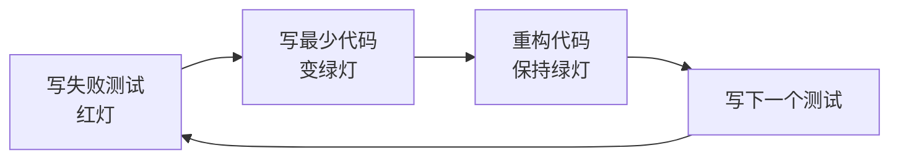

# 测试规范

## 概述

测试是软件质量的守护者。本规范基于测试金字塔模型，涵盖单元测试、集成测试、端到端测试的分层策略，TDD 红绿重构循环，覆盖率目标，性能与安全测试方法，以及测试数据管理，建立从开发到交付的全链路质量保障体系。

---

## 核心规则

### MUST（必须遵守）

1. **MUST - 测试遵循测试金字塔比例**
   - 单元测试占 60-70%（快速、隔离）
   - 集成测试占 20-25%（验证交互）
   - E2E 测试占 5-10%（关键用户流程）

2. **MUST - 核心业务逻辑须有单元测试覆盖**
   - 所有 public 方法必须包含 Happy Path 和至少一个 Error Path 测试

3. **MUST - 测试覆盖率 ≥ 80%**
   - 行覆盖率（Line Coverage）≥ 80%
   - 分支覆盖率（Branch Coverage）≥ 70%
   - 关键模块（支付、安全、合规）≥ 90%

4. **MUST - CI/CD 中测试失败阻断构建**
   - 不允许失败的测试进入主分支

### SHOULD（应该遵守）

1. **SHOULD - 采用 TDD（测试驱动开发）**
   - 红（写失败测试）→ 绿（写最少代码通过）→ 重构（优化代码）

2. **SHOULD - 测试与代码同仓库、同迭代**
   - 测试不是事后的"附加项"，而是开发流程的一部分

3. **SHOULD - 性能测试在 staging 环境定期执行**
   - 每轮迭代或至少每季度做一次基准测试和压力测试

4. **SHOULD - 测试数据隔离管理**
   - 测试数据不应影响生产数据，使用独立的测试数据库或 Mock

### MAY（可以遵守）

1. **MAY - 使用属性基测试（Property-Based Testing）发现边界问题**
2. **MAY - 使用 Chaos Engineering 测试系统韧性**
3. **MAY - 使用 Contract Testing 保障微服务间接口兼容性**

---

## 流程与检查清单

### 测试金字塔详解

```
         /\
        /  \      E2E 测试 (5-10%)
       /    \     关键用户流程、全链路验证
      /------\
     /        \   集成测试 (20-25%)
    /          \  服务交互、DB/API/消息队列集成
   /------------\
  /              \ 单元测试 (60-70%)
 /                \ 函数、类、模块级、无外部依赖
/__________________\
```

| 层级 | 运行速度 | 稳定性 | 调试难度 | 维护成本 |
|------|----------|--------|----------|----------|
| 单元测试 | 毫秒级 | 高 | 低 | 低 |
| 集成测试 | 秒级 | 中 | 中 | 中 |
| E2E 测试 | 分钟级 | 低 | 高 | 高 |

### TDD 红绿重构循环



**TDD 三定律**：
1. 在写生产代码之前，先写失败的测试
2. 只写刚好失败的测试量（编译失败也算失败）
3. 只写刚好通过测试的生产代码量

### 测试覆盖率目标矩阵

| 模块类型 | 行覆盖率 | 分支覆盖率 | 示例模块 |
|----------|---------|-----------|----------|
| 核心业务逻辑 | ≥ 90% | ≥ 85% | 价格计算、支付、权限 |
| 数据处理 | ≥ 85% | ≥ 80% | 数据转换、校验规则 |
| 基础设施 | ≥ 70% | ≥ 60% | 日志、配置、DB 操作 |
| UI 组件 | ≥ 60% | ≥ 50% | 页面组件、路由 |
| 第三方集成 | ≥ 40% | ≥ 30% | 外部 API 调用、SDK |

### 性能测试类型

| 测试类型 | 目的 | 指标 | 工具 |
|----------|------|------|------|
| 基准测试（Benchmark） | 基线性能数据 | 响应时间、TPS | k6 / wrk / ab |
| 压力测试（Stress） | 系统极限承受能力 | 最大并发、错误率 | k6 / Locust / JMeter |
| 负载测试（Load） | 正常负载下表现 | P50/P95/P99 延迟 | k6 / Vegeta |
| 稳定性测试（Soak） | 长期运行稳定性 | 内存泄漏、GC 行为 | k6 / Gatling |
| 尖峰测试（Spike） | 突发流量处理 | 恢复时间、降级行为 | k6 / Locust |

### 安全测试方法

| 方法 | 适用阶段 | 说明 |
|------|----------|------|
| 模糊测试（Fuzz） | 开发/测试 | 自动生成随机输入测试极端情况 |
| 注入测试 | 测试 | SQL 注入、命令注入、SSRF 测试 |
| 认证测试 | 测试 | Token 伪造、Session 劫持、暴力破解 |
| 静态分析（SAST） | 开发 | 代码扫描发现安全漏洞 |
| 动态分析（DAST） | 测试 | 运行时扫描发现安全漏洞 |

### 测试数据管理策略

| 策略 | 适用场景 | 优点 | 缺点 |
|------|----------|------|------|
| In-Memory DB | 单元测试 | 快速、隔离 | 不反映真实 DB 行为 |
| Test Containers | 集成测试 | 真实环境、一键启停 | 启动较慢 |
| Factory / Builder | 数据构造 | 灵活、可读性好 | 需要维护代码 |
| 固定 Seed Data | E2E 测试 | 确定性强 | 数据耦合、维护困难 |
| 数据快照 | 回归测试 | 真实数据场景 | 数据敏感性问题 |

### 测试检查清单

```markdown
## 测试检查清单

### 单元测试
- [ ] 每个 public 方法是否有单元测试？
- [ ] 是否覆盖正常路径和异常路径？
- [ ] 测试是否独立可重复运行？
- [ ] 是否使用 Mock 隔离外部依赖？
- [ ] 测试命名是否清晰（test_{method}_should_{expected}_when_{condition}）？

### 集成测试
- [ ] 数据库读写是否正确？
- [ ] API 请求/响应是否符合契约？
- [ ] 消息队列的发布/订阅是否正常？
- [ ] 外部服务调用是否有超时和重试？

### E2E 测试
- [ ] 是否覆盖核心用户流程？
- [ ] 测试数据是否独立于其他环境？
- [ ] 是否有测试的失败重试机制？
- [ ] 是否有合理的等待策略（避免 flaky）？

### 性能测试
- [ ] 是否已做基准测试获取基线？
- [ ] 压力测试是否达到目标 TPS？
- [ ] P99 延迟是否在 SLA 范围内？
- [ ] 是否已检查内存和 CPU 是否有异常？
```

---

## 参考来源

- Martin Fowler - Test Pyramid
- Kent Beck - Test-Driven Development: By Example
- Gerard Meszaros - xUnit Test Patterns
- OWASP - Testing Guide
- Google Testing Blog - https://testing.googleblog.com
- ISO/IEC/IEEE 29119 - Software Testing Standards
