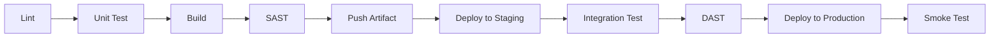

# CI/CD 与部署规范

## 概述

CI/CD（持续集成/持续部署）是现代软件交付的核心实践，直接决定交付速度和质量。本规范涵盖 Pipeline 各阶段设计、蓝绿部署/金丝雀发布/滚动更新等部署策略、IaC 基础设施即代码原则、回滚策略及环境管理，确保软件快速、安全、可重复地交付到生产环境。

---

## 核心规则

### MUST（必须遵守）

1. **MUST - Pipeline 包含完整的质量门禁**
   - `Lint → Unit Test → Build → SAST → Integration Test → DAST → Deploy`
   - 每一阶段失败都应阻断后续流程

2. **MUST - 生产环境部署前须经过 staging 验证**
   - 禁止跳过 staging 直接部署生产

3. **MUST - 所有基础设施使用代码管理**
   - 使用 Terraform / Pulumi / CloudFormation 等 IaC 工具
   - IaC 代码与应用程序代码一样进行 Code Review

4. **MUST - 部署须有回滚能力**
   - 每次部署前确认回滚方案可行
   - 回滚应在 15 分钟内完成

5. **MUST - 环境配置与代码分离**
   - 配置信息通过环境变量或配置中心注入，不写死在代码中

### SHOULD（应该遵守）

1. **SHOULD - 构建产物不可变**
   - 每个构建产生唯一版本号，一经构建不在不同环境下重新编译
   - 使用 Artifact Repository（Nexus / Artifactory / Docker Registry）

2. **SHOULD - 使用部署策略降低风险**
   - 根据业务场景选择蓝绿部署、金丝雀发布或滚动更新

3. **SHOULD - 部署过程自动化**
   - 手动操作仅保留在"一键部署"和"一键回滚"两个场景

4. **SHOULD - Pipeline 执行时间控制在 15 分钟内**
   - 过长的构建时间会降低开发效率

### MAY（可以遵守）

1. **MAY - 使用 Feature Flag 实现渐进式上线**
2. **MAY - 使用 A/B 测试进行灰度验证**
3. **MAY - 使用 GitOps 模式（ArgoCD / Flux）**

---

## 流程与检查清单

### Pipeline 阶段详解



| 阶段 | 工具示例 | 时间预算 | 阻断级别 |
|------|----------|----------|----------|
| Lint | ESLint / Ruff / Checkstyle | < 1 min | 阻断 |
| Unit Test | Jest / Pytest / JUnit | < 3 min | 阻断 |
| Build | Maven / Webpack / Docker | < 5 min | 阻断 |
| SAST | SonarQube / Semgrep | < 3 min | 阻断 |
| Push Artifact | Docker Push / Maven Deploy | < 1 min | 阻断 |
| Deploy to Staging | Ansible / Helm / Terraform | < 5 min | 阻断 |
| Integration Test | Postman / REST Assured | < 5 min | 阻断 |
| DAST | OWASP ZAP | < 10 min | 警告级 |
| Deploy to Production | Helm / Spinnaker | < 5 min | 手动审批 |
| Smoke Test | Custom / Cypress | < 2 min | 回滚触发 |

### 部署策略对比

| 策略 | 原理 | 优点 | 缺点 | 适用场景 |
|------|------|------|------|----------|
| 蓝绿部署 | 两套环境切换流量 | 切换快、回滚即切回 | 成本翻倍 | 关键业务、实时切换 |
| 金丝雀发布 | 小比例流量先走新版本 | 风险可控、可逐步放量 | 时间长、处理复杂 | 大规模用户、谨慎上线 |
| 滚动更新 | 逐步替换实例 | 节省资源、零停机 | 回滚慢、兼容性要求 | 无状态服务、PaaS |
| Recreate | 停旧版再启新版 | 简单 | 有停机窗口 | 内部工具、低可用性要求 |

### IaC 原则

| 原则 | 说明 | 实践 |
|------|------|------|
| 声明式配置 | 描述目标状态而非操作步骤 | Terraform / CloudFormation |
| 版本控制 | IaC 代码与应用程序代码同仓库 | Git + Terraform |
| 不可变基础设施 | 不修改运行中的服务器，重建新实例 | Immutable Server / Container |
| 幂等性 | 重复执行 IaC 得到相同结果 | Terraform Apply 多次安全 |
| 模块化 | 提取可复用的基础设施模块 | Terraform Module |
| 最小权限 | IaC 工具权限最小化 | IAM Role / Service Account |

### 回滚策略

| 部署方式 | 回滚方式 | 操作时间 | 注意事项 |
|----------|----------|----------|----------|
| 蓝绿部署 | 流量切回旧环境 | < 1 min | 确保旧环境未回收 |
| 金丝雀发布 | 流量切回稳定版本 | < 1 min | 确认金丝雀未全量 |
| 滚动更新 | `kubectl rollout undo` | < 5 min | 确认旧版本 Image 存在 |
| Recreate | 重新部署旧版本 | < 10 min | 需要保留旧 Artifact |

**回滚检查清单**：
- [ ] 旧版本 Artifact 是否仍可获取？
- [ ] 数据库 Schema 是否回滚？（是否向后兼容？）
- [ ] 回滚后的 Smoke Test 是否通过？
- [ ] 相关方是否已通知？
- [ ] 是否已记录事故 Root Cause？

### 环境管理规范

| 环境 | 用途 | 稳定性 | 数据源 | 部署频率 |
|------|------|--------|--------|----------|
| dev（开发环境） | 开发自测 | 不稳定 | Mock / 合成数据 | 每次推代码 |
| test（测试环境） | QA 测试 | 中 | 脱敏测试数据 | 每日 |
| staging（预发布） | 集成验证、性能测试 | 高 | 脱敏生产数据副本 | 上线前 |
| production（生产） | 用户使用 | 最高 | 真实数据 | 按发布计划 |

**环境隔离要求**：
- 各环境网络完全隔离
- 生产环境不可直接从 dev 访问
- 数据库不可跨环境共享
- 密钥和凭证按环境独立管理

### 部署检查清单

```markdown
## 部署检查清单

### 部署前
- [ ] 所有 CI 阶段通过
- [ ] Code Review 通过
- [ ] 安全扫描（SAST/DAST）通过
- [ ] DB Migration 已准备且向后兼容
- [ ] Release Notes 已编写
- [ ] 回滚方案已确认
- [ ] 相关方已通知
- [ ] 变更审批已完成

### 部署中
- [ ] 监控已就绪（看板/告警）
- [ ] 部署进度可实时观察
- [ ] 异常时暂停自动放量

### 部署后
- [ ] Smoke Test 通过
- [ ] 关键业务指标正常
- [ ] 日志无异常报错
- [ ] 告警未触发
- [ ] 用户反馈正常（社交监听）
```

---

## 参考来源

- Jez Humble & David Farley - Continuous Delivery
- Kief Morris - Infrastructure as Code
- Martin Fowler - BlueGreenDeployment
- Google SRE - Building Secure and Reliable Systems
- Twelve-Factor App - https://12factor.net
- GitOps - Weaveworks
