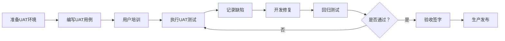

# 验收与交付规范

## 概述

验收与交付是软件工程生命周期中从开发完成到正式上线的最后关口。本规范涵盖 UAT（用户验收测试）流程、验收标准检查清单、交付物清单、SemVer 语义化版本发布流程及 Release Notes 编写模板，确保交付物完整、质量达标、交接有序。

---

## 核心规则

### MUST（必须遵守）

1. **MUST - UAT 环境与生产环境高度一致**
   - 基础设施规格、网络配置、数据样本应与生产环境等价

2. **MUST - 验收标准须在开发开始前定义**
   - 验收标准在需求阶段由产品和 QA 共同确认
   - 不满足验收标准的版本不可发布

3. **MUST - 版本号遵循 SemVer 规范**
   - 格式：`MAJOR.MINOR.PATCH`（如 2.1.3）
   - MAJOR：不兼容的 API 修改
   - MINOR：向下兼容的功能新增
   - PATCH：向下兼容的缺陷修复

4. **MUST - 每个 Release 包含完整交付物**
   - 交付物清单：代码包、部署脚本、数据库脚本、配置文档、API 文档、测试报告

### SHOULD（应该遵守）

1. **SHOULD - UAT 用例覆盖核心业务流程**
   - 应包括 Happy Path、替代路径和异常路径
   - 建议使用 Gherkin 语言编写 UAT 用例

2. **SHOULD - 制作验收签名确认表**
   - 验收人逐项确认并签名，避免后续扯皮

3. **SHOULD - 使用 Release Branch 管理发布版本**
   - 从 develop 或 main 创建 release/x.y.z 分支
   - Release 分支上仅做 Bug 修复，不做新功能

4. **SHOULD - Release Notes 包含已知问题和兼容性说明**
   - 已知问题应说明影响范围和临时方案
   - 兼容性变更应以 Breaking Change 显式标记

### MAY（可以遵守）

1. **MAY - 使用自动化验收测试框架**
2. **MAY - 建立发布日历（Release Calendar）**
3. **MAY - 使用 Feature Flag 配合渐进式验收**

---

## 流程与检查清单

### UAT 流程



### UAT 检查清单

```markdown
## UAT 检查清单

### 功能验收
- [ ] 所有 Must-have 功能是否实现并可通过测试？
- [ ] 用户故事中的验收场景是否全部覆盖？
- [ ] 边界条件和异常处理是否符合预期？
- [ ] 与现有系统的交互是否正常？

### 非功能验收
- [ ] 响应时间是否在 SLA 范围内？
- [ ] 并发用户数是否满足业务需求？
- [ ] 系统是否支持 7x24 运行？
- [ ] 数据备份和恢复方案是否已验证？

### 用户体验
- [ ] 页面加载时间是否在可接受范围内？
- [ ] 错误提示是否友好清晰？
- [ ] 业务流程是否流畅无冗余操作？
- [ ] 移动端/不同浏览器是否正常？

### 安全性
- [ ] 权限控制是否按设计实现？
- [ ] 敏感数据是否加密处理？
- [ ] 审计日志是否完整？
- [ ] 安全扫描是否通过？
```

### 交付物清单

| 类别 | 交付物 | 验收标准 | 责任人 |
|------|--------|----------|--------|
| 代码 | 源代码压缩包或 Git Tag | 通过 Code Review，版本 Tag 正确 | 开发 |
| 代码 | Docker Image / Binary | 构建产物可部署，版本标签正确 | 开发 |
| 文档 | SRS 最终版 | 与交付功能一致 | 产品 |
| 文档 | API 文档（OpenAPI / Swagger） | 每个接口有完整描述和示例 | 开发 |
| 文档 | 架构设计文档 | 与实现一致 | 架构师 |
| 文档 | 部署运维手册 | 涵盖安装、配置、监控、常见问题 | DevOps |
| 文档 | Release Notes | 格式规范，内容完整 | PM |
| 数据库 | DDL 变更脚本 | 可重复执行、向后兼容 | DBA |
| 测试 | 测试报告（含覆盖率） | 覆盖率 ≥ 80%，测试全部通过 | QA |
| 测试 | 性能测试报告 | 指标满足 SLA | QA |
| 部署 | 部署脚本 / Helm Chart | 一键部署到 staging 和生产 | DevOps |
| 部署 | 监控配置（Grafana / Prometheus） | 关键指标已接入告警 | DevOps |

### SemVer 版本发布流程

```
版本号格式: MAJOR.MINOR.PATCH (例如 3.2.1)

版本增量规则:
┌─────────┬──────────────┬──────────────────────┐
│ 版本部分 │ 变更类型     │ 示例                  │
├─────────┼──────────────┼──────────────────────┤
│ MAJOR   │ Breaking     │ 接口不兼容、删除功能  │
│         │ Change       │                      │
├─────────┼──────────────┼──────────────────────┤
│ MINOR   │ 新增功能     │ 新增 API、新增功能    │
│         │ (向下兼容)   │ 模块、标记弃用        │
├─────────┼──────────────┼──────────────────────┤
│ PATCH   │ Bug 修复     │ 缺陷修复、性能优化    │
│         │ (向下兼容)   │ 不影响功能行为        │
└─────────┴──────────────┴──────────────────────┘

预发布标签: 1.0.0-alpha.1 → 1.0.0-beta.1 → 1.0.0-rc.1 → 1.0.0

发布分支流程:
1. 从 develop 创建 release/2.3.0
2. 在 release 分支上测试和修 Bug
3. 打 Tag v2.3.0
4. 合并到 main 和 develop
5. 删除 release 分支
```

### Release Notes 模板

```markdown
# Release Notes - v{version}

## 版本信息
- 版本号：v{MAJOR.MINOR.PATCH}
- 发布日期：{YYYY-MM-DD}
- 发布负责人：{name}

## 概述
{简要描述本次发布的整体目标和内容}

## 新功能（New Features）
- {功能标题} - {Issue/PR 链接}
  - 描述：{功能说明}
  - 使用指引：{如何使用}

## 改进（Enhancements）
- {改进描述} - {Issue/PR 链接}

## Bug 修复（Bug Fixes）
- {Bug 描述} - {Issue/PR 链接}
  - 影响范围：{影响说明}

## 破坏性变更（Breaking Changes）
- {变更说明} - {Issue/PR 链接}
  - 迁移指南：{如何迁移}

## 依赖更新
- {依赖名}: {旧版本} → {新版本}

## 已知问题（Known Issues）
- {问题描述} - 临时方案：{方案}

## 兼容性说明
- 是否需要数据库迁移？（是/否）
- 是否向后兼容？（是/否）
- 是否依赖特定环境配置？（是/否）

## 致谢
感谢参与本次发布的团队成员和相关贡献者。
```

### 验收签字确认表

```markdown
# 验收签字确认表

项目名称：__________________
版本号：__________________
验收日期：__________________

## 验收项
| 序号 | 验收项 | 验收人 | 结果 | 备注 |
|------|--------|--------|------|------|
| 1 | 功能完整性 | | PASS/FAIL | |
| 2 | 性能达标 | | PASS/FAIL | |
| 3 | 安全性审查 | | PASS/FAIL | |
| 4 | 文档完整性 | | PASS/FAIL | |
| 5 | 部署验证 | | PASS/FAIL | |

## 签字
产品负责人：__________  日期：__________
技术负责人：__________  日期：__________
QA 负责人：__________   日期：__________
客户代表：__________    日期：__________
```

---

## 参考来源

- SemVer - https://semver.org
- IEEE 1012 - Verification and Validation
- ISO/IEC 25010 - Software Quality Requirements and Evaluation
- ISTQB - Acceptance Testing
- Atlassian - Release Management Best Practices
- Keep a Changelog - https://keepachangelog.com
