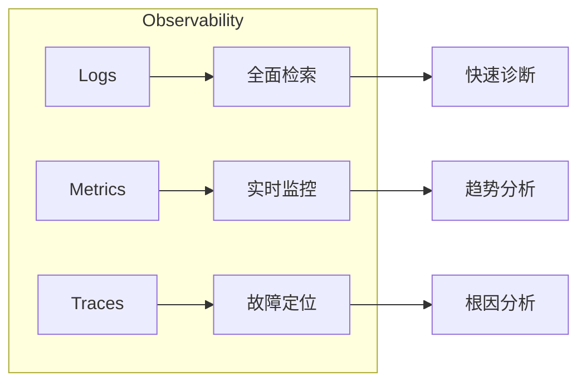

# 运维与监控规范

## 概述

运维与监控是软件上线后稳定运行的基础保障。本规范基于可观测性三大支柱（Logs / Metrics / Traces），涵盖 SLO/SLI/SLA 定义与衡量、告警规则设计避免告警疲劳、事件响应全流程（Incident Response）、事后复盘（Postmortem）模板以及日常运维检查清单，确保系统长期健康运行。

---

## 核心规则

### MUST（必须遵守）

1. **MUST - 所有服务接入可观测性三大支柱**
   - Logs（日志）：结构化日志，集中采集和存储
   - Metrics（指标）：关键业务和技术指标实时采集
   - Traces（链路追踪）：请求全链路追踪，支持跨服务

2. **MUST - 为关键服务定义 SLO 并监控**
   - SLO（服务级别目标）必须有明确的 SLI（服务级别指标）衡量方法
   - SLO 未达标时必须触发告警

3. **MUST - 告警规则配置避免告警疲劳**
   - 告警必须有优先级（P0/P1/P2/P3）
   - P0 告警必须在 5 分钟内响应，P1 在 15 分钟内响应
   - 禁止无 Actionable 步骤的告警

4. **MUST - 每次生产事故须有 Postmortem**
   - Postmortem 旨在学习改进，而非追责
   - 包含根本原因分析、时间线、改进措施和跟踪

### SHOULD（应该遵守）

1. **SHOULD - 使用仪表盘（Dashboard）统一展示系统状态**
   - 至少包含：系统健康总览、关键业务指标、基础设施状态
   - 仪表盘应分层：管理层视图、运维视图、开发视图

2. **SHOULD - 日志需要保留适当周期**
   - 热存储（可查询）≥ 7 天
   - 冷存储（归档）≥ 90 天（合规要求可延长至 1 年）

3. **SHOULD - 建立事件响应轮值（On-Call）制度**
   - 轮值人员须有明确的 escalation 路径

4. **SHOULD - 定期做故障演练（Chaos Engineering / Game Day）**
   - 模拟真实故障验证告警和响应流程

### MAY（可以遵守）

1. **MAY - 使用 AIOps 辅助异常检测**
2. **MAY - 建立容量规划模型**
3. **MAY - 实现自愈能力（Auto-Remediation）**

---

## 流程与检查清单

### 可观测性三大支柱



| 支柱 | 定义 | 工具示例 | 最佳实践 |
|------|------|----------|----------|
| Logs | 离散的事件记录，描述发生了什么 | ELK / Loki / Splunk | 结构化 JSON 格式、包含 trace_id、统一时区 UTC |
| Metrics | 可聚合的数值数据，描述系统状态 | Prometheus / Datadog / Grafana | 四大黄金信号：延迟、流量、错误率、饱和度 |
| Traces | 请求在分布式系统中的完整路径 | Jaeger / Zipkin / OpenTelemetry | 统一 Trace ID 传播、采样策略（头部/尾部） |

### SLO / SLI / SLA 定义

| 概念 | 说明 | 示例 |
|------|------|------|
| SLI (Service Level Indicator) | 服务质量的量化指标 | 请求延迟 P99、错误率、可用性百分比 |
| SLO (Service Level Objective) | 团队承诺的目标值 | P99 延迟 < 200ms，月度可用性 ≥ 99.9% |
| SLA (Service Level Agreement) | 对客户的正式承诺（含补偿） | 月度可用性 99.9%，未达标补偿 10% 费用 |

**SLO 设定原则**：
- 不要追求 100%（成本指数级增长）
- 设置 Error Budget（错误预算）= 1 - SLO
  - 100% - 99.9% = 0.1% 月度错误预算 ≈ 43 分钟/月
  - 错误预算耗尽时应冻结新功能发布，优先投入稳定性

### 常见 SLI 指标

| 类别 | SLI 指标 | 衡量方法 |
|------|----------|----------|
| 可用性 | 服务正常运行时间百分比 | Health Check 成功率 |
| 延迟 | 请求响应时间 | P50 / P95 / P99 |
| 吞吐量 | 每秒请求数（RPS / QPS） | 请求计数 / 时间 |
| 错误率 | 请求失败百分比 | HTTP 5xx / 4xx 占比 |
| 饱和度 | 资源使用率 | CPU / Memory / Disk / 连接数 |

### 告警优先级与响应

| 优先级 | 定义 | 响应时间 | 示例 | 通知方式 |
|--------|------|----------|------|----------|
| P0 | 服务完全不可用 | 5 min | 生产宕机、核心功能不可用 | 电话 + 即时消息 |
| P1 | 服务严重受损 | 15 min | 功能严重降级、大量用户受影响 | 即时消息 + 电话 |
| P2 | 部分功能异常 | 2 h | 非核心功能异常、小范围影响 | 即时消息 |
| P3 | 告警但不紧急 | Next Sprint | 磁盘使用率预警、证书即将过期 | 邮件 / 工单 |

**告警设计原则**：
- 每条告警必须有明确的排查步骤（Runbook）
- 避免重复告警（Alert Fatigue）
- 避免过于敏感导致告警风暴
- 区分告警（Alert）和通知（Notification）

### 事件响应流程


### 事件指挥官（Incident Commander）职责

| 角色 | 职责 |
|------|------|
| Incident Commander | 全局协调，决策"做什么"，不参与具体排查 |
| Scribe | 记录事件时间线和操作，确保不遗漏 |
| SME（主题专家） | 在 IC 指挥下执行具体排查和修复 |
| Liaison | 对外沟通，向管理者和客户通报进展 |

### Postmortem 模板

```markdown
# 事后复盘报告 (Postmortem)

## 基本信息
- 事件标题：
- 事件编号：INC-{YYYYMMDD}-{序号}
- 日期：{YYYY-MM-DD}
- 持续时间：{开始} → {结束}（共 XX 分钟）
- 影响范围：{影响的用户数和功能}
- 严重级别：P0 / P1 / P2 / P3

## 事件摘要
{用 2-3 句话描述发生了什么及其影响}

## 时间线
| 时间 (UTC) | 事件 |
|------------|------|
| HH:MM | 告警触发 |
| HH:MM | 响应开始 |
| HH:MM | 初步诊断（原因 X） |
| HH:MM | 开始修复 |
| HH:MM | 恢复验证 |
| HH:MM | 事件关闭 |

## 根本原因分析 (RCA)
{使用 5 Whys 方法逐层深入分析}

## 改进措施
| 措施 | 责任人 | 追踪 Issue | 截止日期 | 状态 |
|------|--------|-----------|----------|------|
| {措施描述} | {owner} | #{issue} | {date} | [ ] |

## 经验教训
- 做对了什么：
- 做错了什么：
- 下次可以改进什么：

## 附录
- 相关监控截图
- 相关日志片段
- 相关告警配置
```

### 日常运维 Checklist

```markdown
## 日常运维检查清单

### 每日检查
- [ ] 关键服务健康状态正常？
- [ ] P0/P1 告警无未处理？
- [ ] 磁盘使用率 < 80%？
- [ ] 证书未在 30 天内过期？
- [ ] 备份任务成功执行？

### 每周检查
- [ ] 错误趋势是否有上升？
- [ ] 慢查询是否有增加？
- [ ] 依赖服务（第三方 API）响应正常？
- [ ] 值班人员已安排好？

### 每月检查
- [ ] SLO 达标率月度回顾
- [ ] Error Budget 使用情况
- [ ] 容量规划（流量增长趋势）
- [ ] 安全补丁更新情况
- [ ] 日志归档和清理是否正常

### 每季度检查
- [ ] 故障演练（Game Day）
- [ ] 应急预案更新
- [ ] IaC 代码完整性和一致性审计
- [ ] 权限审计（最小权限原则）
- [ ] 成本优化分析
```

---

## 参考来源

- Google SRE - Site Reliability Engineering
- Betsy Beyer - The Site Reliability Workbook
- Monitoring Distributed Systems - Google SRE Book
- Observability Engineering - Charity Majors
- Incident Response - Atlassian / PagerDuty Best Practices
- Dave Caddy - The Four Golden Signals
- OpenTelemetry - https://opentelemetry.io
